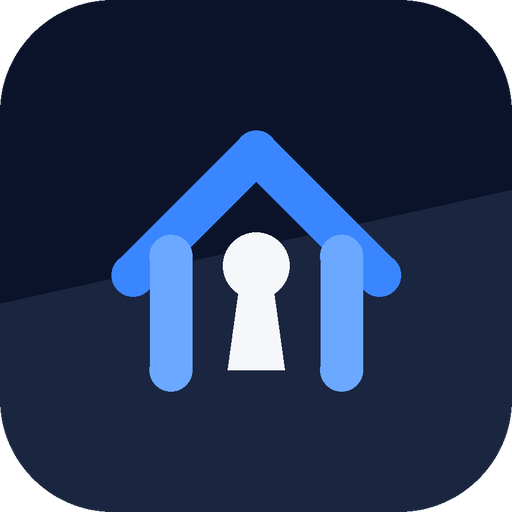

<div align="center">



# Haven

**A private place for what matters.**<br>
Reminders that really ring, tasks and a password keeper, encrypted on your phone. Nothing leaves it.

[](https://github.com/norypt-website/Haven/releases/latest)
[](LICENSE)
[](#requirements)


<sub>By <a href="https://norypt.com">Norypt</a></sub>

</div>

---

## Why Haven

Most reminder and password apps want an account, a cloud and your data. Haven wants none of it.
It has **no account, no sync, no telemetry and no `INTERNET` permission**; the build fails if any
dependency tries to add one. Everything works in airplane mode, and a reminder set in Haven rings
like an alarm clock: on the lock screen, in Doze, on battery saver, and after a reboot before you
have even unlocked the phone.

## Features

| | |
|---|---|
| ⏰ **Reminders that ring** | One-time and recurring (daily, weekly, monthly, yearly, every *N*, end rules), exact alarms with full-screen ringing, snooze presets, early "coming up" alerts, quick rescheduling, explicit time-zone and DST policies. |
| ✅ **Tasks** | Lists, search, due dates, starring, priority levels, and a follow-up alarm if a task is still open after its due time. |
| 🔑 **Password keeper** | Separately unlocked vault for website logins with a generator (passwords and passphrases), folders, masked reveal and a self-clearing clipboard. |
| 💾 **Two-factor backups** | Encrypted `.hvbk` files in *Downloads/Haven*. Restoring needs **both** the passphrase you choose and a 256-bit backup key shown once in the app. Cloud pickers are refused. |
| 🛡️ **Duress password** | Opt-in second password. Typed under pressure it silently replaces the vault with an empty decoy and shows only "Wrong password". |
| 🌓 **Norypt design** | Light, dark and system themes; reflows at 200 % font scale; every touch target at least 48 dp. |

## Security at a glance

- **Two-layer key envelope.** Each vault's random database key is wrapped by an Android Keystore key (StrongBox when the device has one, TEE otherwise, never software in release builds) and then by a key derived from your password with **Argon2id** (64–256 MiB, tuned per device at setup). Both layers are AES-256-GCM with authenticated headers, so envelopes cannot be swapped, downgraded or edited.
- **Encrypted storage.** Content and passwords live in two independent **SQLCipher** databases in app-private storage that Android never backs up or transfers.
- **Nothing readable on the lock screen.** Ringing notifications and the Direct Boot alarm store contain only timing and generic text. Screenshots and recents previews are blocked, overlay windows are hidden while Haven is open.
- **Password change revokes the old one.** Keystore keys are rotated on every change, so an old copy of the key file is useless even to someone who later learns the old password.
- **Honest limits.** Haven says plainly what it cannot do: it cannot scrub flash remnants after deletion, retract what a clipboard history already read, or ring while the phone is off. Deleting data retires the keys instead of pretending to wipe the chip.

The backup container is specified in [`backup-format/FORMAT.md`](backup-format/FORMAT.md).

## Install

Download the signed APK from the [latest release](https://github.com/norypt-website/Haven/releases/latest), verify its SHA-256 against the release notes, and install it. Android will ask you to allow installs from your browser or file manager the first time.

### Requirements

- Android 12 or newer (API 31), arm64 recommended; armeabi-v7a, x86 and x86_64 libraries are included.
- A device screen lock. Haven keys are hardware-bound and require it.
- Roughly 30 MB of storage and, during unlock, up to 256 MB of free memory for Argon2id.

## Build from source

```bash
git clone https://github.com/norypt-website/Haven.git
cd Haven
./gradlew testDebugUnitTest :recurrence-engine:test :backup-format:test   # 160 tests
./gradlew assembleDebug                                                    # app/build/outputs/apk/debug/
```

Release builds are signed out of tree with a `keystore.properties` that never enters the repository (see `keystore.properties.example`). Dependency checksums are pinned in `gradle/verification-metadata.xml`, and `tools/check-apk.sh` asserts that a built APK has no network permission and no exported service or provider.

## Project layout

| Module | Role |
|---|---|
| `app` | Jetpack Compose UI, navigation, session and lock wiring, backup manager |
| `vault-crypto` | Argon2id, Android Keystore wrapping, key envelopes, keyring, duress verifier |
| `vault-storage` | Room + SQLCipher databases (content vault, password vault) |
| `recurrence-engine` | Pure Kotlin recurrence expansion with explicit DST, zone and month-end policies |
| `alarm-runtime` | Direct Boot schedule store, exact alarms, ringing service, readiness checks |
| `backup-format` | Two-factor encrypted container (Argon2id + HKDF, Tink streaming AEAD) |
| `security-controls` | Lock policy, clipboard, secure window, guess throttling, safe logging |

## Status

Version 0.1.0 is feature-complete for its v1 scope. 160 JVM unit tests and the instrumented
Keystore/SQLCipher suites pass. StrongBox keys, Direct Boot ringing, Doze and battery-saver
delivery, the duress wipe and the full backup → wipe → restore cycle were verified on a Pixel 9
running Android 17, and an internal adversarial code review was completed with its findings fixed.
**No independent security audit has been performed yet.**

## Security policy

Please report vulnerabilities privately through GitHub's *Report a vulnerability* form on this
repository, not in a public issue. Details in [`SECURITY.md`](SECURITY.md).

## License

Haven is free software under the [GNU Affero General Public License v3.0](LICENSE). Modified
versions that are distributed or offered as a service must publish their source under the same
terms. Haven itself has no network code, so the service clause only matters for forks that add one.

<div align="center"><sub>© Norypt. Haven and the Haven mark are original work; the Norypt shield is a trademark of Norypt.</sub></div>
